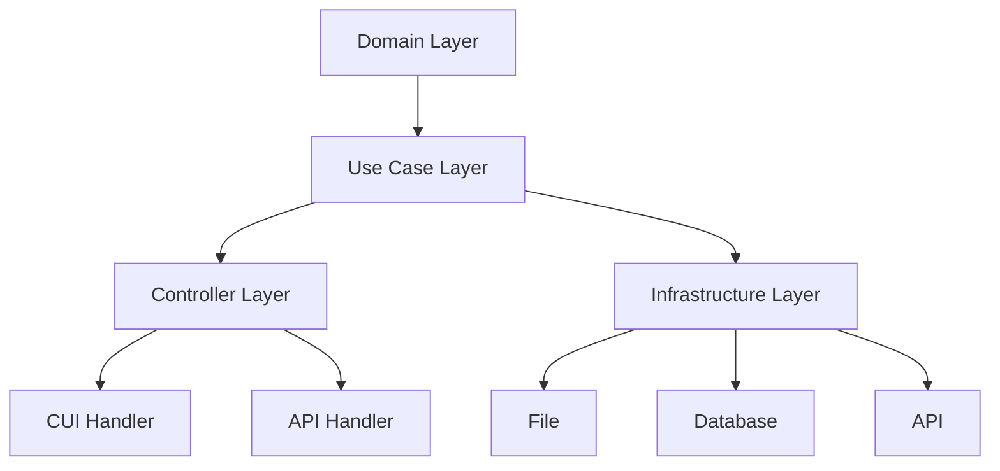

# System Patterns

## Architecture Overview
This project follows the Clean Architecture pattern, which separates the application into distinct layers with clear responsibilities:

## Layer Responsibilities

### Domain Layer
- Contains the core business entities (models)
- Defines the structure and behavior of domain objects
- Has no dependencies on other layers
- Currently includes stock price models:
  - `StockPrice`: Basic stock price information with stock ID and price
  - `DailyStockPrice`: Stock price with date information, embedding StockPrice
  - `StockPriceStatistics`: Statistical information for a collection of stock prices, including average, max, min, and standard deviation

### Use Case Layer
- Implements business logic and rules
- Uses domain models
- Follows functional programming principles with pure functions
- Has no side effects

### Infrastructure Layer
- Handles external interactions (file, database, API)
- Converts between domain models and external data formats
- Contains no business logic

### Controller Layer
- Orchestrates the flow between use cases and infrastructure
- Calls infrastructure and use case functions in sequence
- Handles the coordination of multiple operations

### Handler Layer
- CUI: Processes command-line arguments and calls controllers
- API: Processes HTTP requests and calls controllers

## Key Design Patterns

### Dependency Inversion
- Higher-level modules do not depend on lower-level modules
- Both depend on abstractions

### Repository Pattern
- Infrastructure layer implements repository interfaces
- Provides a clean separation between domain and data access

### Pure Functions
- Use case functions are designed as pure functions
- No side effects, same output for same input

## Code Organization Principles
- Each layer is in its own package
- Public functions for cross-layer communication
- Private functions for internal implementation details
- Clear naming conventions for functions and variables
- Constants defined at the top of files
